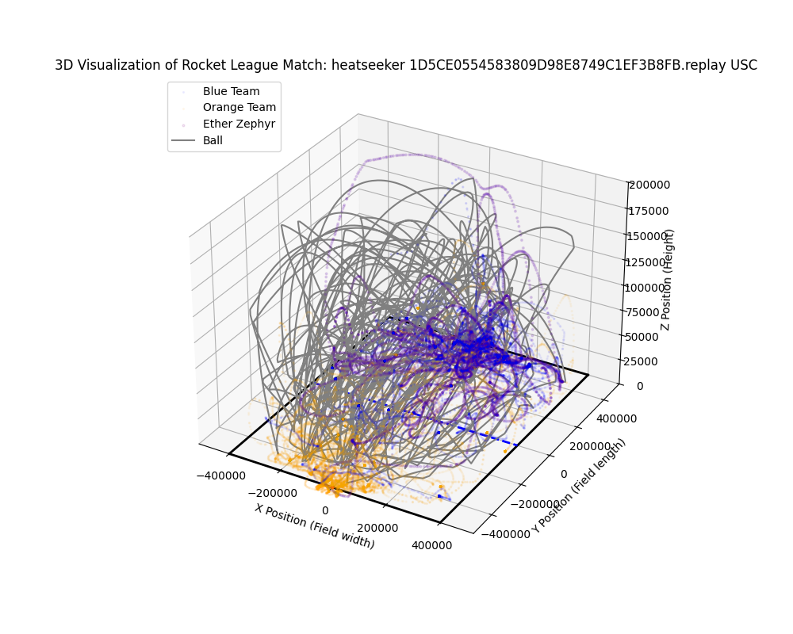
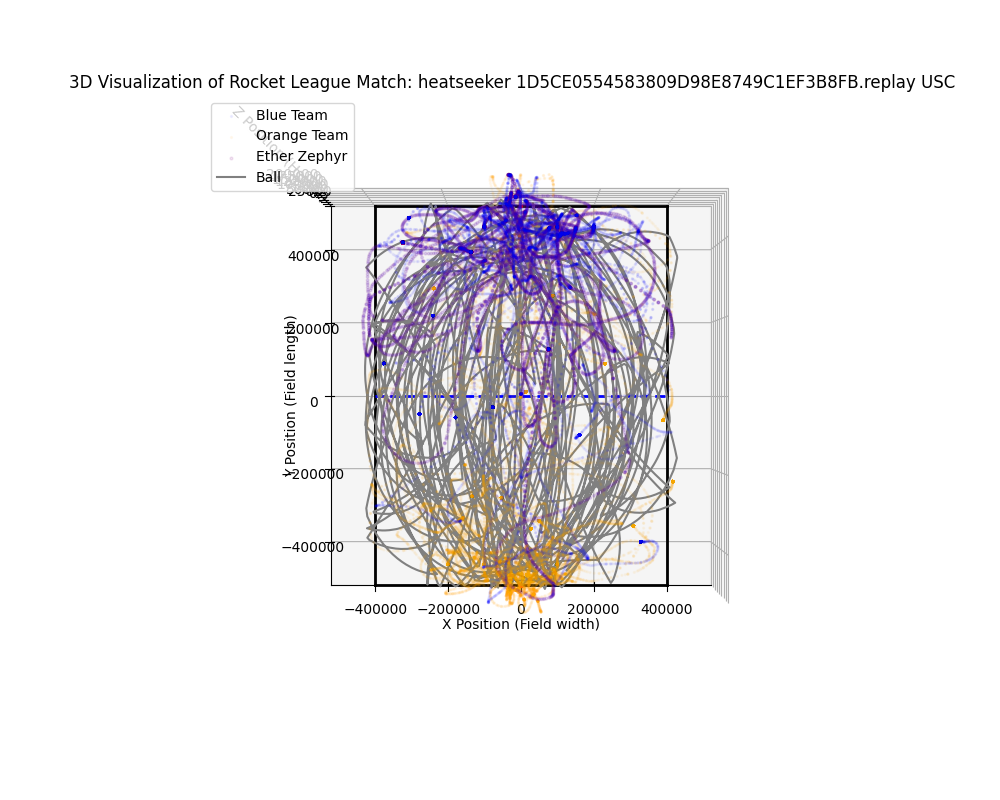

## EXAMPLE Feedback for 1D5CE0554583809D98E8749C1EF3B8FB replay heatseeker USC

Analyzing the heatseeker Rocket League game for Ether Zephyr provides insights into their performance and areas for improvement. Here’s some coaching feedback based on the given data:

### Positional Awareness:
1. **Distance to the Ball:** At multiple timestamps, Ether Zephyr's distance to the ball is quite high, indicating they might be out of the play frequently. It’s crucial to maintain a good positional sense to be closer to the ball, which allows for quicker responses.
   
2. **Rotation & Positioning:** Ether Zephyr should focus on quicker rotations back to the goal after an attacking play. This ensures they are ready to defend if the opponent gets control.

### Speed and Movement:
1. **Speed Consistency:** Ether Zephyr has high variation in speed throughout the match. Maintaining consistent speed can help in both offense and defense, making transitions smoother.

2. **Boost Management:** Although boost is unlimited in this mode, using speed sensibly can help with control. It’s important to ensure Ether Zephyr combines boost and regular speed to position effectively.

### Defensive Play:
1. **Positioning in Goal:** When on defense, Ether Zephyr should ensure they are in a central position relative to the ball trajectory, which allows for more effective saves.
   
2. **Anticipate Ball Trajectory:** In heatseeker mode, the ball gravitates towards the goal. It’s crucial to read the trajectory early and position for potential rebounds or redirects.

### Offensive Play:
1. **Ball Interception:** Ether Zephyr should practice intercepting the ball at earlier opportunities to put pressure on the opponents. Approaching the ball at a more central position helps in maintaining offensive pressure.
   
2. **Shot Variety:** Incorporating varied shot angles can make their attacks less predictable and harder to defend against.

### Overall Strategy:
- Encourage Ether Zephyr to work on reading the ball's trajectory earlier and position themselves accordingly. This will help in both offensive and defensive plays.
- Suggest practicing rotations and positioning drills to improve spatial awareness and reduce the distance to the ball during critical plays.
- Focus on team communication to ensure Ether Zephyr is coordinating with teammates for passes and rotations, especially in a mode where the ball movement is highly predictable.

By emphasizing these areas, Ether Zephyr can enhance their efficiency and effectiveness in heatseeker matches.

